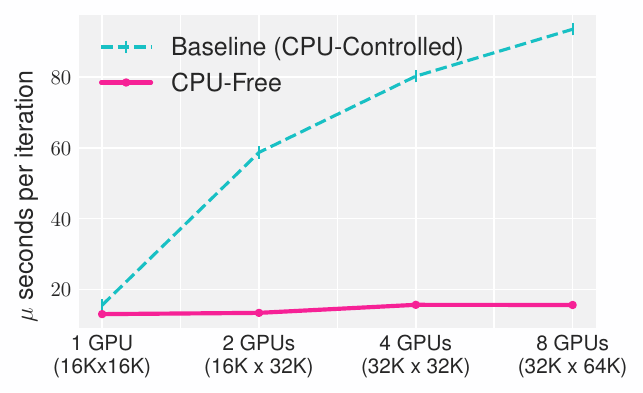
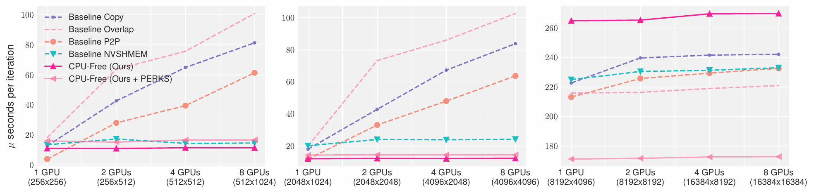
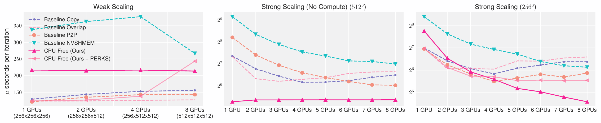

[//]: # (<h1 align="center"> )

[//]: # ()

[//]: # (<p> CPU-Free Iterative Solvers</p>)

[//]: # (</h1>)

[//]: # (<h3 align="center">)
[//]: # (    <p> Multi-GPU Communication Schemes for IterativeSolvers: When CPUs are Not in Charge </p>)
[//]: # (</h3>)

# Multi-GPU Communication Schemes for Iterative Solvers: When CPUs are Not in Charge

---

This paper proposes a fully autonomous execution model for multi-GPU applications that completely excludes the
involvement of the CPU beyond the initial kernel launch. In a typical multi-GPU application, the host serves as
the orchestrator of the execution by directly launching kernels, issuing communication calls, and acting as a
synchronizer for devices. We argue that this orchestration, or control flow path, causes undue overhead, and can
be delegated completely to devices to improve performance in applications that require communication among peers.
For the proposed CPU-free execution model, we leverage existing techniques such as persistent kernels, thread block
specialization, device-side barriers and device-initiated communication routines to write fully autonomous multi-GPU
code and achieve significantly reduced communication overheads. We demonstrate our proposed model on two broadly used
iterative solvers, 2D/3D Jacobian stencil and Conjugate Gradient(CG). Compared to the CPU-controlled baselines,
CPU-free model can improve 3D stencil communication overhead by 58.8% and provide 1.63x speedup for CG on 8 Nvidia
A100 GPUs.

Communication Overhead             |  Overlap Percentage
:-------------------------:|:-------------------------:
  |  

---

## Dependencies

- C++ Compiler with C++-17 support
- CUDA 11.6 or above
- [NVSHMEM 2.7.0 or above](https://docs.nvidia.com/nvshmem/install-guide/index.html)
  - GDRCopy 2.0 or above*
  - InfiniBand GPUDirect Async support*
- OpenMPI 4.1.4 or above

*multi-node support

### Setup

1. Sample spack installation

```bash
$ spack install nvshmem +gpu_initiated_support +cuda +gdrcopy +ucx +mpi ^openmpi +cuda fabrics=ucx ^ucx +cuda +gdrcopy +dm +thread_multiple
```

2. Sample environment variables for Makefile

```bash
# spack load nvshmem

export NVSHMEM_HOME=$SPACK_HOME/.../nvshmem
export MPI_HOME=$SPACK_HOME/.../openmpi
export CUDA_HOME=$SPACK_ROOT/.../cuda
export UCX_HOME=$SPACK_ROOT/.../ucx
export LD_LIBRARY_PATH="$NVSHMEM_HOME/lib:$UCX_HOME/lib:$CUDA_HOME/lib:$MPI_HOME/lib:$LD_LIBRARY_PATH"
```

---

## Compilation

We provide Direct P2P and NVSHMEM versions of Conjugate Gradient and 2D/3D Jacobian Stencil. Below are the provided targets:

- `make all`: Compile all available versions
  - `make cg`: Conjugate Gradient NVSHMEM implementations
  - `make stencil`: Compiles all Stencil implementations
    - `make jacobi2D`: Jacobi 2D Stencil P2P version
    - `make jacobi3D`: Jacobi 3D Stencil P2P version
    - `make jacobi2D_nvshmem`: Jacobi 2D Stencil NVSHMEM version*
    - `make jacobi3D_nvshmem`: Jacobi 3D Stencil NVSHMEM version*
- `make format`: Autoformat with `.clang-format`

Binaries are placed in `bin/`

Versions marked with `*` have multi-node support.

---

## Versions
Each binary produced is a composite of multiple versions selected at runtime such as 
different CPU-Free implementations and Baselines. For example:

```bash
$ ./bin/cg
Versions (select with -v):
0:	Baseline Discrete Standard
1:	Baseline Discrete Pipelined
2:	Single Stream Standard
3:	Single Stream Pipelined
4:	Single Stream Pipelined Multi Overlap
5:	Single Stream Standard Saxpy Overlap
6:	Profiling Discrete Standard
7:	Profiling Discrete Pipelined
8:	Single GPU Discrete Standard

Running Baseline Discrete Standard

Execution time:  24.8550 s
```

Select the desired version with the `-v <version num>` flag. CG versions additionally
support multiple versions delimited by `,`, for example, `./bin/cg -v 0,1,2`.

#### Stencil versions:
- `Baseline Copy/Overlap/P2P/NVSHMEM`: Baseline versions taken from NVIDIA [multi-gpu-programming-models](https://github.com/NVIDIA/multi-gpu-programming-models).
- `Design 1`: CPU-Free P2P version with two streams.
- `Design 2`: CPU-Free P2P version with one stream.
- `Design X NVSHMEM`: (Available in NVSHMEM binaries) CPU-Free version with NVSHMEM communication.
- `Design X Partitioned`: CPU-Free version with better thread block partitioning.
- `PERKS`: Optimized caching implementations adapted from [PERKS](https://github.com/neozhang307/PERKS).

The best performing versions reported in the paper are `Design 1 NVSHMEM` and its `Partitioned` counterpart, and `PERKS`.

#### CG Versions:
- `Discrete`: ~
- `Pipelined`: ~
- `Profiling`: ~

### Flags

- `-s`: Suppress version information output. Prints execution time only.
- `-v <version num>`: Version selection. Default: `0`.
- `-v <version num>[,version num...]` (CG only): Version selection
- `-nx <dim>`: X dimension size. Default: `16384` for 2D, `512` for 3D.
- `-ny <dim>`: Y dimension size.
- `-nz <dim>`: Z dimension size (if 3D).
- `-niter <num>`: Number of iterations. Default: `1000`.
- `-compare`: Accuracy comparison with 1 GPU.

Example:

```bash
$ ./bin/jacobi2D -s -v 3 -nx 1024 -ny 1024 -niter 10000
```

### NVSHMEM Launch

Launching CG and Stencil NVSHMEM versions requires `mpirun`. Example:

```bash
$ mpirun -np 8 ./bin/jacobi3D_nvshmem -s -v 1 -nx 512 -ny 512 -nz 512 -niter 100
```

### Multi-Node Launch (NVHSMEM only)

No special parameters need to be set for multi-node launch. 

---

## Results

### 2d5p Jacobi Stencil



### 3d7p Jacobi Stencil



### Conjugate Gradient


---

## Citing

```bibtex
@inproceedings{CPU-Free-Model,
  author = {Ismayilov, Ismayil and Baydamirli, Javid and Sa\u{g}bili, Do\u{g}an and Wahib, Mohamed and Unat, Didem},
  title = {Multi-GPU Communication Schemes for Iterative Solvers: When CPUs Are Not in Charge},
  year = {2023},
  url = {https://doi.org/10.1145/3577193.3593713},
  doi = {10.1145/3577193.3593713},
  booktitle = {Proceedings of the 37th International Conference on Supercomputing},
  series = {ICS '23}
}
```

---

## Acknowledgement

---

This project has received funding from the European Research
Council (ERC) under the European Union’s Horizon 2020 research
and innovation programme (grant agreement No 949587).

---

- CPU-Free Stencil versions adapted from NVIDIA [multi-gpu-programming-models](https://github.com/NVIDIA/multi-gpu-programming-models) repo.
- PERKS code adapted from [neozhang307/PERKS](https://github.com/neozhang307/PERKS).
 
